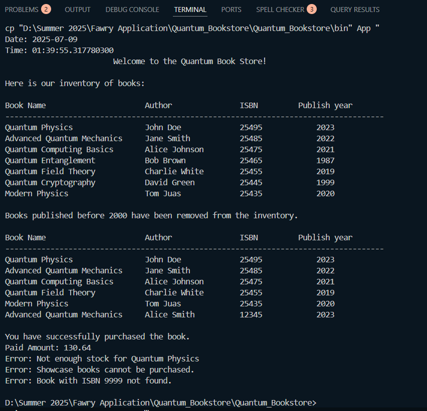

# Quantum_Bookstore
# 📚 Quantum Bookstore

Welcome to the **Quantum Bookstore** – a simple Java-based simulation of an online bookstore that supports paper books, ebooks, and showcase/demo books.

## 🧠 Project Overview

This project models a bookstore system with the following features:

- Manage an inventory of different book types:
  - `PaperBook`: physical books with weight and shipping cost.
  - `EBook`: digital books with file type and email delivery.
  - `ShowcaseBook`: demo books not for sale.
- Display inventory.
- Add and remove books.
- Purchase books with validation for:
  - Valid ISBN
  - Book type (not showcase)
  - Stock availability
- Print out formatted book lists and payment information.

All output is prefixed with `Quantum Book Store`.

---

## 🏁 How to Run

### Prerequisites
- Java 8 or higher
- Any IDE or terminal to compile and run

### Steps

1. Clone the repository:
   ```bash
   git clone https://github.com/saeed174/Quantum_Bookstore.git
   cd Quantum_Bookstore

   ---

## Output Screen


